<div align="center">
  
</div>

```yaml
# ~/about/faiq.yaml
user:          "Muhammad Faiq"
location:      "Indonesia"
class:         "Software Engineer"
guild:         "Computer Science Student"
current_quests: ["Machine Learning", "Web3 Development"]
strategy:      "treat software like chess & gacha — high risk, calculated moves, high reward"
os:            "Arch Linux (btw)"
ide:           "an AI agent"
hobbies:       ["chess", "tetris", "rubik's cube", "games"]
trait:         "jack of all trades"
```

---

<div align="center">

### `~/var/log/chess` — live

<!--START_SECTION:chessStats-->
<!-- Automatically generated with https://github.com/Balastrong/chess-stats-action -->

| Type | Rapid ⏲️ | Blitz ⚡ | Bullet 🔫 |
|:---:|:---:|:---:|:---:|
| Current | 1008 | 867 | 648 |
| Best | 1008 | 867 | 756 |

| White ⚪ | Black ⚫ | Result 🏆 | Date 📅 | Position 🗺️ | Type 🕕 |
|:---:|:---:|:---:|:---:|:---:|:---:|
| **poggufanz** | Micheltato | win 🥇 | 4/8/2026 | <a href="http://www.ee.unb.ca/cgi-bin/tervo/fen.pl?select=8/p5R1/3Np3/k2bP3/N7/1PK5/P7/8 b - - 4 49">Link</a> | Blitz |
| Annie_Sunil | **poggufanz** | win 🥇 | 3/8/2026 | <a href="http://www.ee.unb.ca/cgi-bin/tervo/fen.pl?select=8/8/4r1pk/8/3b4/5K2/3N4/8 w - - 6 51">Link</a> | Blitz |
| **poggufanz** | Popors1964 | win 🥇 | 1/8/2026 | <a href="http://www.ee.unb.ca/cgi-bin/tervo/fen.pl?select=8/p4kR1/5B2/2Pp4/8/4r2P/P6P/R5K1 b - - 0 28">Link</a> | Blitz |
| **poggufanz** | CBRdinesh | win 🥇 | 1/8/2026 | <a href="http://www.ee.unb.ca/cgi-bin/tervo/fen.pl?select=1N6/8/8/8/5P2/4K3/6Q1/k6R b - - 4 67">Link</a> | Blitz |
| jaura157 | **poggufanz** | win 🥇 | 1/8/2026 | <a href="http://www.ee.unb.ca/cgi-bin/tervo/fen.pl?select=r2q2k1/p3pN2/2p3p1/7p/8/1QPn4/PP3RPP/6K1 w - - 4 23">Link</a> | Blitz |
| **poggufanz** | jaura157 | win 🥇 | 1/8/2026 | <a href="http://www.ee.unb.ca/cgi-bin/tervo/fen.pl?select=r2k3r/1p1Q1p1p/4pq2/1B1pN1p1/3P1B2/2N1P1P1/1P3K1P/7R b - - 0 19">Link</a> | Blitz |
| jaura157 | **poggufanz** | stalemate ⏸️ | 1/8/2026 | <a href="http://www.ee.unb.ca/cgi-bin/tervo/fen.pl?select=8/7K/2p1kb1P/2P1p3/8/6r1/p7/8 w - - 0 42">Link</a> | Blitz |
| **poggufanz** | bellucci123 | win 🥇 | 1/8/2026 | <a href="http://www.ee.unb.ca/cgi-bin/tervo/fen.pl?select=1k6/2p5/1p5p/5pp1/1R6/2P1P1B1/1n1K1PPP/8 b - - 0 28">Link</a> | Blitz |
| hasani90 | **poggufanz** | resigned ❌ | 1/8/2026 | <a href="http://www.ee.unb.ca/cgi-bin/tervo/fen.pl?select=r1q1r1k1/ppp1npb1/3p4/5p1N/2PP2p1/1P2P1P1/P2N1PBP/R2Q1RK1 b - - 0 17">Link</a> | Blitz |
| jhr911 | **poggufanz** | win 🥇 | 25/7/2026 | <a href="http://www.ee.unb.ca/cgi-bin/tervo/fen.pl?select=7r/p2qppk1/3p2n1/1p6/2p5/PPR1Q3/2PK1Nr1/7n b - - 1 27">Link</a> | Blitz |

<!--END_SECTION:chessStats-->

</div>

---

<div align="center">

### `~/usr/bin/stack`


</div>

---

<div align="center">

### `~/var/log/activity`


<br><br>


<br>


<br>

<picture>
  <source media="(prefers-color-scheme: dark)" srcset="https://raw.githubusercontent.com/poggufanz/poggufanz/output/github-contribution-grid-snake-dark.svg" />
  <source media="(prefers-color-scheme: light)" srcset="https://raw.githubusercontent.com/poggufanz/poggufanz/output/github-contribution-grid-snake.svg" />
  
</picture>

</div>

---

### `~/mnt/socials`

```console
$ ping socials --all
```

- `x.com` ⟶ [@mfanxz](https://x.com/mfanxz) ......... `reachable`
- `linkedin` ⟶ [muhammad-faiq](https://www.linkedin.com/in/muhammad-faiq-1450832ab/) ......... `reachable`
- `instagram` ⟶ [@poggufanz](https://instagram.com/poggufanz) ......... `reachable`
- `facebook` ⟶ [mffaiq12](https://facebook.com/mffaiq12/) ......... `reachable`
- `mail` ⟶ [mfaiq1205@gmail.com](mailto:mfaiq1205@gmail.com) ......... `0% packet loss`

<br>

<div align="center">
  
  
</div>
